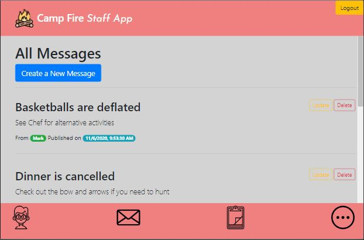
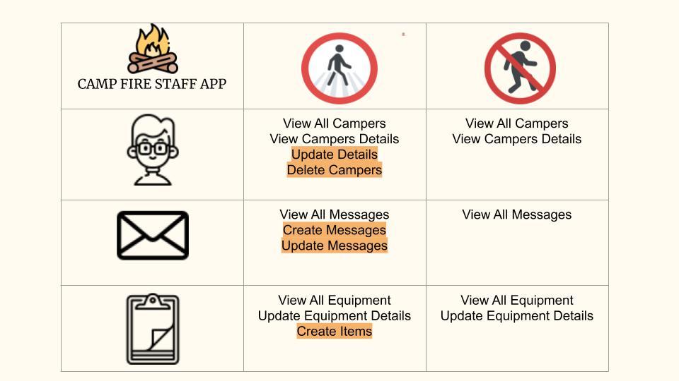

<h1 align="center">
	
</h1>

<h3 align="center">
	A stress-free summer camp organizer
</h3>

	<strong>
		<a href="https://summercampstaffapp.herokuapp.com/">Website</a>
	</strong>

	

## Overview

- **View important messages to the camp from Admin**
- **See a Snapshot of Camper Data**
- **View status of equipment**
- **Responsive interface.**
- **Update, Create and Delete any items with a login**
- **Limit use by junior staffers**

## Technologies Used

- **MERN**
- **Bootstrap**
- **JWT**
- **mongoimport**

## Authentication

### Authenticated Users have access to CRUD options that a viewer does not have.

	

## Further Development

- **Admin can give different access to certain logged in users**
- **Hash Passwords as user types**
- **Change equipment status without needing a new page**
- **Expand the More features on larger screens**
- **Create a calendar show current day activities**
- **Dashboard**
- **Using Dropdowns and Radios in Forms**
- **Join databases**
- **Add pictures of Campers**
- **PWA**

